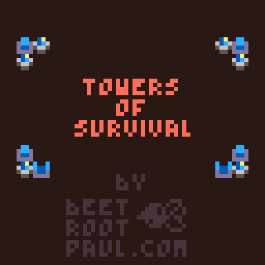
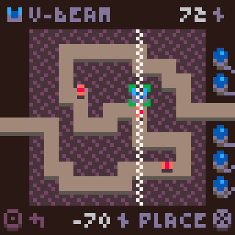
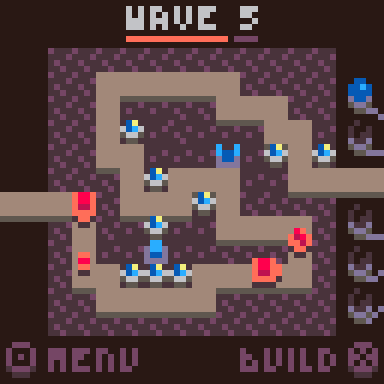

# Towers of Survival (BeetPx)

> a low-rez tower defense [BeetPx](https://github.com/beetrootpaul/beetpx) game

The original version was created by [Beetroot Paul](https://beetrootpaul.com) in
PICO-8 and submitted for the
[LOWREZJAM 2022](https://itch.io/jam/lowrezjam-2022) – a game jam which requires
games to have resolution of 64x64px.

---

This game is available to play in your browser on
https://beetrootpaul.itch.io/towers-of-survival-beetpx

**Controls**

- `X` on a keyboard or on a screen (on touch devices) - enter tower building /
  choose a selected tower / place a tower
- `Z` on a keyboard or `O` on a screen (on touch devices) - open menu / cancel
- keyboard arrows or `WSAD` or `WSAD` on a screen (on touch devices) - select
  next or previous tower / choose a place for a tower

---

Enemies are approaching. There are 10 waves of them. We need to survive.

There are 3 types of towers you can build:

- **laser** - the fast one,
- **v-beam** - the stronger one; its beam covers all tiles above and below,
  therefore you cannot build anything else on its way,
- **booster** - this one makes all surrounding lasers and v-beams shoot longer
  and re-charger faster; you can "stack" boosters to increase total boost – each
  laser can be boosted up to 8 times and each v-beam up to 6 times (not 8,
  because 2 tiles are reserved.

Our base have 5 cores. Each enemy is capable of destroying one core. Without
cores, we cannot survive, it's that simple.

Good luck! You are our last hope…

---

